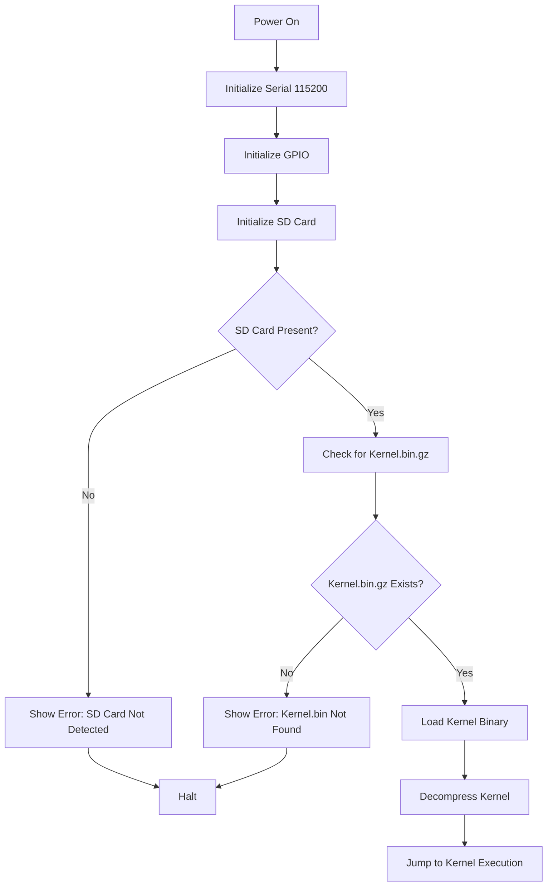
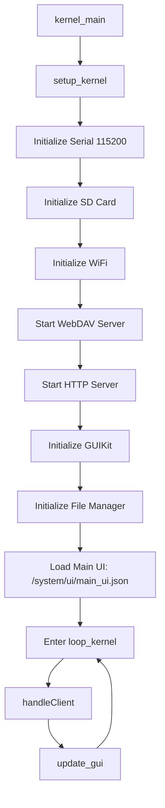
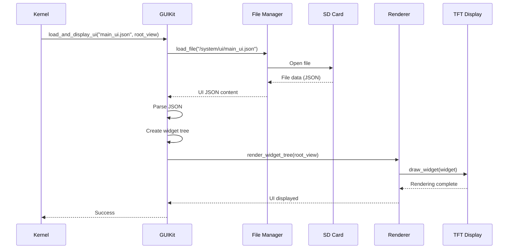
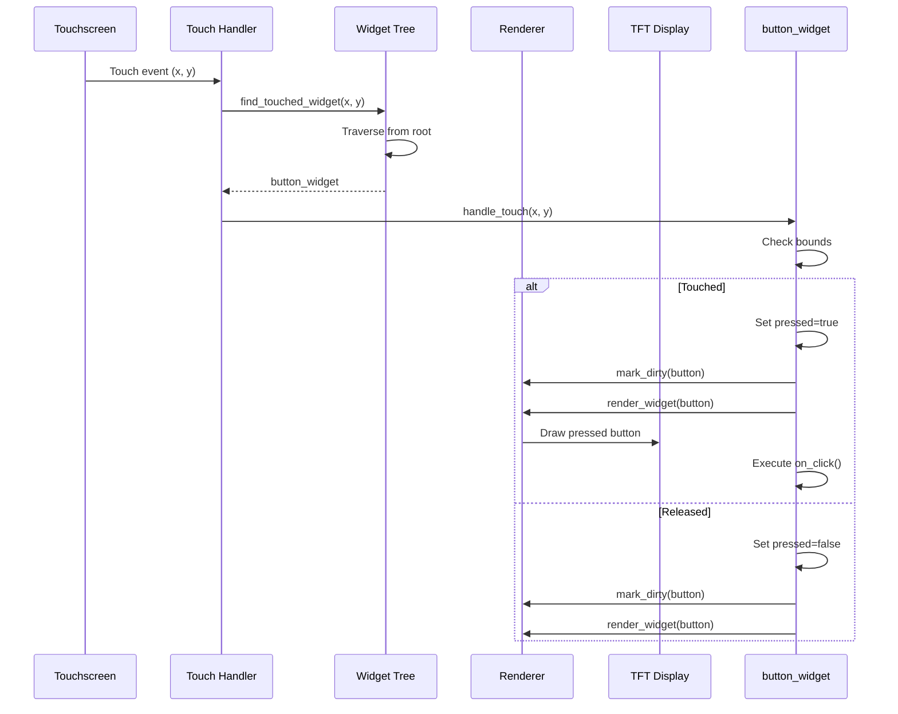
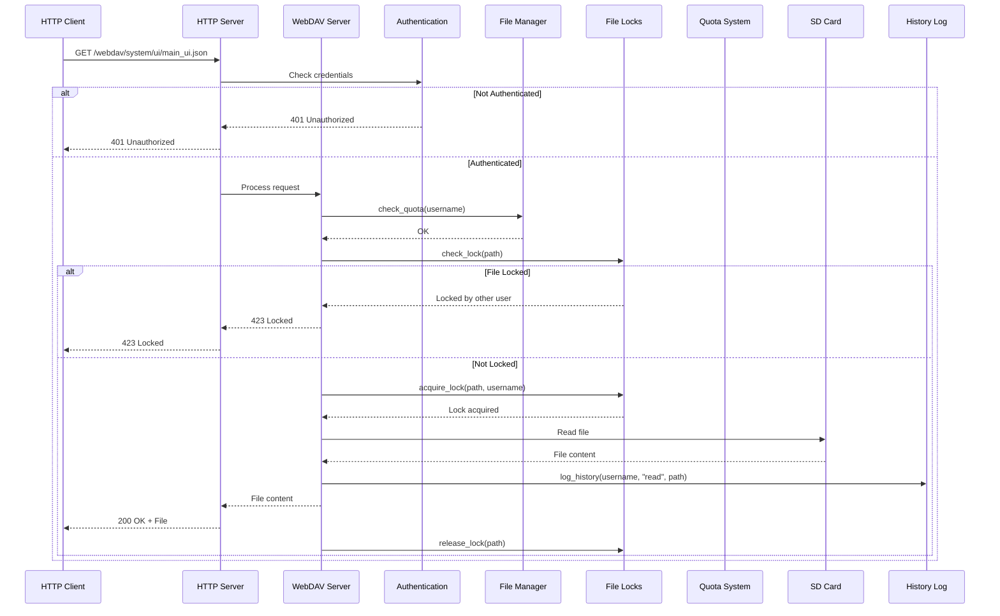

# Data Flow Architecture

This document describes the data flow sequences, state machines, and interaction patterns within the system.

---

## Table of Contents

1. [Boot Sequence](#boot-sequence)
2. [Kernel Initialization Sequence](#kernel-initialization-sequence)
3. [UI Loading Flow](#ui-loading-flow)
4. [Touch Event Flow](#touch-event-flow)
5. [WebDAV Request Flow](#webdav-request-flow)
6. [File Write Flow](#file-write-flow)
7. [Memory Management Flow](#memory-management-flow)

---

## Boot Sequence

### Bootloader Workflow

```
┌─────────────────────────────────────────────────────────────┐
│                    BOOTLOADER SEQUENCE                           │
├─────────────────────────────────────────────────────────────┤
│                                                                  │
│  Power On                                                         │
│      │                                                             │
│      ▼                                                             │
│  ┌─────────────────────────────────────────────────────────┐  │
│  │  Step 1: Initialize Hardware                                │  │
│  │  ┌─────────────┐  ┌─────────────┐                         │  │
│  │  │  Serial      │  │   TFT       │                         │  │
│  │  │  @115200    │  │  (optional)  │                         │  │
│  │  └─────────────┘  └─────────────┘                         │  │
│  │  ┌─────────────┐                                            │  │
│  │  │  GPIO       │                                            │  │
│  │  │  Setup      │                                            │  │
│  │  └─────────────┘                                            │  │
│  └─────────────────────────────────────────────────────────┘  │
│                                                                  │
│  ┌─────────────────────────────────────────────────────────┐  │
│  │  Step 2: Initialize SD Card                                 │  │
│  │  ┌─────────────────────────────────────────────────────┐  │  │
│  │  │  sd.begin(SD_CS_PIN, SPI)                              │  │  │
│  │  │  - Check if card is present                            │  │  │
│  │  │  - Initialize FAT32 file system                        │  │  │
│  │  └─────────────────────────────────────────────────────┘  │  │
│  │                                                             │  │
│  │  SD Card OK?                                               │  │
│  │  ├── YES → Continue to Step 3                              │  │
│  │  └── NO → Error Screen → Halt                             │  │
│  └─────────────────────────────────────────────────────────┘  │
│                                                                  │
│  ┌─────────────────────────────────────────────────────────┐  │
│  │  Step 3: Check for Kernel Binary                           │  │
│  │  ┌─────────────────────────────────────────────────────┐  │  │
│  │  │  sd.exists(KERNEL_FILE)                                │  │  │
│  │  │  - Check for "/Kernel.bin.gz" or "/Kernel.bin"         │  │  │
│  │  └─────────────────────────────────────────────────────┘  │  │
│  │                                                             │  │
│  │  Kernel.bin exists?                                        │  │
│  │  ├── YES → Continue to Step 4                              │  │
│  │  └── NO → Error Screen ("Kernel.bin Not Found") → Halt   │  │
│  └─────────────────────────────────────────────────────────┘  │
│                                                                  │
│  ┌─────────────────────────────────────────────────────────┐  │
│  │  Step 4: Load and Decompress Kernel                         │  │
│  │  ┌─────────────────────────────────────────────────────┐  │  │
│  │  │  Load kernel file into memory buffer                    │  │  │
│  │  │  Decompress if gzipped                                   │  │  │
│  │  │  Verify integrity                                        │  │  │
│  │  └─────────────────────────────────────────────────────┘  │  │
│  │                                                             │  │
│  │  Loading successful?                                       │  │
│  │  ├── YES → Jump to kernel                                  │  │
│  │  └── NO → Error Screen → Halt                              │  │
│  └─────────────────────────────────────────────────────────┘  │
│                                                                  │
│  ┌─────────────────────────────────────────────────────────┐  │
│  │  Step 5: Jump to Kernel Execution                         │  │
│  │  - Set up kernel entry point                              │  │
│  │  - Transfer control to kernel                             │  │
│  │  - Bootloader completes successfully                      │  │
│  └─────────────────────────────────────────────────────────┘  │
│                                                                  │
└─────────────────────────────────────────────────────────────┘
```

### Boot Sequence Diagram (Mermaid)



---

## Kernel Initialization Sequence

```
┌─────────────────────────────────────────────────────────────┐
│                    KERNEL INITIALIZATION                         │
├─────────────────────────────────────────────────────────────┤
│                                                                  │
│  kernel_main()                                                    │
│      │                                                             │
│      ▼                                                             │
│  ┌─────────────────────────────────────────────────────────┐  │
│  │  Step 1: Setup Kernel                                         │  │
│  │  ┌─────────────────────────────────────────────────────┐  │  │
│  │  │  setup_kernel()                                           │  │  │
│  │  │                                                             │  │  │
│  │  │  1.1 Initialize Serial                                    │  │  │
│  │  │     Serial.begin(115200)                                  │  │  │
│  │  │     Serial.println("Noyau demarre.")                    │  │  │
│  │  │                                                             │  │  │
│  │  │  1.2 Initialize SD Card                                   │  │  │
│  │  │     if (!sd.begin(SD_CS_PIN, SPI)) {                    │  │  │
│  │  │         Serial.println("Erreur: Carte SD.");            │  │  │
│  │  │         return;                                           │  │  │
│  │  │     }                                                   │  │  │
│  │  │     Serial.println("Carte SD initialisee.");            │  │  │
│  │  │                                                             │  │  │
│  │  │  1.3 Initialize WiFi                                      │  │  │
│  │  │     WiFi.begin("SSID", "PASSWORD")                      │  │  │
│  │  │     Wait for connection...                               │  │  │
│  │  │     Serial.print("IP: ");                               │  │  │
│  │  │     Serial.println(WiFi.localIP());                      │  │  │
│  │  │                                                             │  │  │
│  │  │  1.4 Initialize WebDAV Server                             │  │  │
│  │  │     webdav_server.setAuthentication(                      │  │  │
│  │  │         WEBDAV_USERNAME, WEBDAV_PASSWORD)                   │  │  │
│  │  │     http_server.begin();                                  │  │  │
│  │  │     Serial.println("Serveur WebDAV demarre.");           │  │  │
│  │  │                                                             │  │  │
│  │  │  1.5 Initialize HTTP Server                               │  │  │
│  │  │     init_web_server(&http_server);                        │  │  │
│  │  │     Serial.println("Serveur HTTP demarre.");            │  │  │
│  │  │                                                             │  │  │
│  │  │  1.6 Initialize GUIKit                                     │  │  │
│  │  │     init_gui();                                           │  │  │
│  │  │     Serial.println("GUIKit initialise.");                │  │  │
│  │  │                                                             │  │  │
│  │  │  1.7 Initialize File Manager                              │  │  │
│  │  │     init_file_manager();                                  │  │  │
│  │  │     Serial.println("Gestionnaire de fichiers init.");   │  │  │
│  │  │                                                             │  │  │
│  │  │  1.8 Load Main UI                                        │  │  │
│  │  │     load_and_display_ui("main_ui.json", get_root_view());│  │  │
│  │  │     Serial.println("Interface principale chargee.");   │  │  │
│  │  │                                                             │  │  │
│  │  └─────────────────────────────────────────────────────┘  │  │
│  └─────────────────────────────────────────────────────────┘  │
│                                                                  │
│  ┌─────────────────────────────────────────────────────────┐  │
│  │  Step 2: Main Loop                                           │  │
│  │  ┌─────────────────────────────────────────────────────┐  │  │
│  │  │  loop_kernel()                                            │  │  │
│  │  │                                                             │  │  │
│  │  │  while (1) {                                              │  │  │
│  │  │      http_server.handleClient();                         │  │  │
│  │  │      update_gui();                                        │  │  │
│  │  │      delay(10);                                           │  │  │
│  │  │  }                                                       │  │  │
│  │  └─────────────────────────────────────────────────────┘  │  │
│  └─────────────────────────────────────────────────────────┘  │
│                                                                  │
└─────────────────────────────────────────────────────────────┘
```

### Kernel Initialization Diagram (Mermaid)



---

## UI Loading Flow

```
┌─────────────────────────────────────────────────────────────┐
│                    UI LOADING FLOW                              │
├─────────────────────────────────────────────────────────────┤
│                                                                  │
│  load_and_display_ui("main_ui.json", root_view)               │
│      │                                                             │
│      ▼                                                             │
│  ┌─────────────────────────────────────────────────────────┐  │
│  │  Step 1: Locate UI File                                      │  │
│  │  - Construct path: /system/ui/main_ui.json                  │  │
│  │  - Check if file exists on SD card                          │  │
│  │  - Open file for reading                                     │  │
│  └─────────────────────────────────────────────────────────┘  │
│                                                                  │
│  ┌─────────────────────────────────────────────────────────┐  │
│  │  Step 2: Parse JSON                                          │  │
│  │  - Read file contents into buffer                           │  │
│  │  - Parse JSON to extract widget hierarchy                   │  │
│  │  - Validate widget structure                                 │  │
│  └─────────────────────────────────────────────────────────┘  │
│                                                                  │
│  ┌─────────────────────────────────────────────────────────┐  │
│  │  Step 3: Create Widget Tree                                  │  │
│  │  - Create root widget (VIEW)                               │  │
│  │  - Recursively create child widgets                        │  │
│  │  - Parse widget properties (position, size, style)        │  │
│  │  - Set up event callbacks                                   │  │
│  │  - Add children to parent containers                        │  │
│  └─────────────────────────────────────────────────────────┘  │
│                                                                  │
│  ┌─────────────────────────────────────────────────────────┐  │
│  │  Step 4: Apply Styles                                        │  │
│  │  - Apply default styles from styles.json                    │  │
│  │  - Apply widget-specific styles                             │  │
│  │  - Resolve style inheritance                               │  │
│  └─────────────────────────────────────────────────────────┘  │
│                                                                  │
│  ┌─────────────────────────────────────────────────────────┐  │
│  │  Step 5: Render Widget Tree                                 │  │
│  │  - Mark all widgets as dirty                               │  │
│  │  - Call render_all()                                       │  │
│  │  - Each widget draws itself to TFT                          │  │
│  │  - Clear dirty flags after rendering                        │  │
│  └─────────────────────────────────────────────────────────┘  │
│                                                                  │
│  Return: true (success) or false (failure)                    │
│                                                                  │
└─────────────────────────────────────────────────────────────┘
```

### UI Loading Diagram (Mermaid)



---

## Touch Event Flow

```
┌─────────────────────────────────────────────────────────────┐
│                    TOUCH EVENT FLOW                              │
├─────────────────────────────────────────────────────────────┤
│                                                                  │
│  XPT2046 Touchscreen                                           │
│      │                                                         │
│      ▼                                                         │
│  ┌─────────────────────────────────────────────────────────┐  │
│  │  Step 1: Touch Detection                                    │  │
│  │  - XPT2046 detects touch on screen                         │  │
│  │  - Reads X/Y coordinates                                    │  │
│  │  - Maps to display coordinates (0-240, 0-320)             │  │
│  │  - Creates TouchPoint struct                              │  │
│  └─────────────────────────────────────────────────────────┘  │
│                                                                  │
│  ┌─────────────────────────────────────────────────────────┐  │
│  │  Step 2: Find Touched Widget                               │  │
│  │  - Start at root widget                                    │  │
│  │  - Recursively check each widget's bounds                  │  │
│  │  - Return first widget that contains the touch point       │  │
│  │  - Return NULL if no widget touched                        │  │
│  └─────────────────────────────────────────────────────────┘  │
│                                                                  │
│  ┌─────────────────────────────────────────────────────────┐  │
│  │  Step 3: Handle Touch Event                                │  │
│  │  - Widget type switch                                      │  │
│  │  - Button: Set pressed=true, redraw, call on_click         │  │
│  │  - Slider: Update value based on position, call on_change   │  │
│  │  - Label: No action (not interactive)                      │  │
│  │  - View: Pass touch to children                           │  │
│  └─────────────────────────────────────────────────────────┘  │
│                                                                  │
│  ┌─────────────────────────────────────────────────────────┐  │
│  │  Step 4: Release/Update State                               │  │
│  │  - If touch released (not pressed)                         │  │
│  │  - Button: Set pressed=false, redraw                       │  │
│  │  - Slider: Finalize value update                           │  │
│  └─────────────────────────────────────────────────────────┘  │
│                                                                  │
└─────────────────────────────────────────────────────────────┘
```

### Touch Event Diagram (Mermaid)



---

## WebDAV Request Flow

```
┌─────────────────────────────────────────────────────────────┐
│                   WEBDAV REQUEST FLOW                           │
├─────────────────────────────────────────────────────────────┤
│                                                                  │
│  HTTP Client                                                    │
│      │                                                             │
│      ▼                                                             │
│  ┌─────────────────────────────────────────────────────────┐  │
│  │  Step 1: Receive Request                                     │  │
│  │  - Parse HTTP request                                       │  │
│  │  - Extract method (GET, PUT, DELETE, etc.)                   │  │
│  │  - Extract path                                              │  │
│  │  - Extract headers (Authorization, etc.)                     │  │
│  └─────────────────────────────────────────────────────────┘  │
│                                                                  │
│  ┌─────────────────────────────────────────────────────────┐  │
│  │  Step 2: Authentication                                      │  │
│  │  - Check Authorization header                               │  │
│  │  - Validate username/password                               │  │
│  │  - If invalid: Return 401 Unauthorized                      │  │
│  └─────────────────────────────────────────────────────────┘  │
│                                                                  │
│  ┌─────────────────────────────────────────────────────────┐  │
│  │  Step 3: Check File Lock (for write operations)            │  │
│  │  - If PUT/DELETE/MKCOL:                                    │  │
│  │    - Check if file is locked                               │  │
│  │    - If locked by other user: Return 423 Locked            │  │
│  │    - If locked by current user: Proceed                    │  │
│  │    - If not locked: Proceed                                 │  │
│  └─────────────────────────────────────────────────────────┘  │
│                                                                  │
│  ┌─────────────────────────────────────────────────────────┐  │
│  │  Step 4: Check Quota (for write operations)                │  │
│  │  - If PUT/MKCOL:                                           │  │
│  │    - Check user's available space                          │  │
│  │    - If space insufficient: Return 413 or 402               │  │
│  │    - If space sufficient: Proceed                          │  │
│  └─────────────────────────────────────────────────────────┘  │
│                                                                  │
│  ┌─────────────────────────────────────────────────────────┐  │
│  │  Step 5: Resolve Mount Points                               │  │
│  │  - Check if path is a mount point                          │  │
│  │  - If yes: Map to physical path                             │  │
│  │  - If no: Use path as-is                                    │  │
│  └─────────────────────────────────────────────────────────┘  │
│                                                                  │
│  ┌─────────────────────────────────────────────────────────┐  │
│  │  Step 6: Execute Operation                                  │  │
│  │  - GET: Read file, return contents                         │  │
│  │  - PUT: Write file, update used_space                       │  │
│  │  - DELETE: Remove file                                      │  │
│  │  - MKCOL: Create directory                                  │  │
│  │  - PROPFIND: List directory contents                        │  │
│  └─────────────────────────────────────────────────────────┘  │
│                                                                  │
│  ┌─────────────────────────────────────────────────────────┐  │
│  │  Step 7: Log History (for successful operations)            │  │
│  │  - Log action to history.log                               │  │
│  │  - Include username, action, path, timestamp                 │  │
│  └─────────────────────────────────────────────────────────┘  │
│                                                                  │
│  Return: Response to client                                    │
│                                                                  │
└─────────────────────────────────────────────────────────────┘
```

### WebDAV Request Diagram (Mermaid)



---

## File Write Flow

```
┌─────────────────────────────────────────────────────────────┐
│                    FILE WRITE FLOW                               │
├─────────────────────────────────────────────────────────────┤
│                                                                  │
│  Request: PUT /webdav/system/ui/new_ui.json                     │
│      │                                                             │
│      ▼                                                             │
│  ┌─────────────────────────────────────────────────────────┐  │
│  │  Step 1: Authentication                                      │  │
│  │  - Validate username/password                               │  │
│  │  - Extract username from credentials                        │  │
│  └─────────────────────────────────────────────────────────┘  │
│                                                                  │
│  ┌─────────────────────────────────────────────────────────┐  │
│  │  Step 2: Check File Lock                                    │  │
│  │  - Is file already locked?                                 │  │
│  │  - If yes: Is current user the owner?                       │  │
│  │    - If yes: Proceed (extend lock)                          │  │
│  │    - If no: Return 423 Locked                              │  │
│  │  - If no lock: Acquire lock for current user               │  │
│  └─────────────────────────────────────────────────────────┘  │
│                                                                  │
│  ┌─────────────────────────────────────────────────────────┐  │
│  │  Step 3: Check Quota                                        │  │
│  │  - Get file size from Content-Length header                │  │
│  │  - Check user.used_space + file_size <= user.max_space     │  │
│  │  - If no: Return 413 Payload Too Large or 402             │  │
│  │  - If yes: Proceed                                          │  │
│  └─────────────────────────────────────────────────────────┘  │
│                                                                  │
│  ┌─────────────────────────────────────────────────────────┐  │
│  │  Step 4: Write File                                         │  │
│  │  - Open file on SD card (create if not exists)             │  │
│  │  - Write data from request body                            │  │
│  │  - Close file                                               │  │
│  │  - Update user.used_space += file_size                      │  │
│  └─────────────────────────────────────────────────────────┘  │
│                                                                  │
│  ┌─────────────────────────────────────────────────────────┐  │
│  │  Step 5: Release Lock and Log                              │  │
│  │  - Release file lock                                       │  │
│  │  - Log to history.log                                       │  │
│  │  - Return success response                                  │  │
│  └─────────────────────────────────────────────────────────┘  │
│                                                                  │
│  Return: 201 Created or 204 No Content                          │
│                                                                  │
└─────────────────────────────────────────────────────────────┘
```

---

## Memory Management Flow

```
┌─────────────────────────────────────────────────────────────┐
│                   MEMORY MANAGEMENT FLOW                         │
├─────────────────────────────────────────────────────────────┤
│                                                                  │
│  Widget Creation                                                │
│      │                                                             │
│      ▼                                                             │
│  ┌─────────────────────────────────────────────────────────┐  │
│  │  Step 1: Allocate from Pool                                 │  │
│  │  - Check if pool has available slots                        │  │
│  │  - If pool full: Return NULL                               │  │
│  │  - If pool available: Return pointer to next slot          │  │
│  │  - Increment pool index                                     │  │
│  └─────────────────────────────────────────────────────────┘  │
│                                                                  │
│  ┌─────────────────────────────────────────────────────────┐  │
│  │  Step 2: Initialize Widget                                  │  │
│  │  - Set default values (position, size, colors)              │  │
│  │  - Set type from parameter                                  │  │
│  │  - For buttons: Set text, callback                          │  │
│  │  - Mark as not dirty                                        │  │
│  └─────────────────────────────────────────────────────────┘  │
│                                                                  │
│  ┌─────────────────────────────────────────────────────────┐  │
│  │  Step 3: Add to Parent (if applicable)                      │  │
│  │  - Reallocate parent's children array                      │  │
│  │  - Add widget pointer to array                              │  │
│  │  - Increment parent's children_count                        │  │
│  └─────────────────────────────────────────────────────────┘  │
│                                                                  │
│  Widget Destruction                                             │
│      │                                                             │
│      ▼                                                             │
│  ┌─────────────────────────────────────────────────────────┐  │
│  │  Step 1: Remove from Parent                                 │  │
│  │  - Find widget in parent's children array                   │  │
│  │  - Remove from array                                        │  │
│  │  - Decrement parent's children_count                        │  │
│  └─────────────────────────────────────────────────────────┘  │
│                                                                  │
│  ┌─────────────────────────────────────────────────────────┐  │
│  │  Step 2: Free Resources (if any)                           │  │
│  │  - Free dynamically allocated text (if used)                │  │
│  │  - Release any associated resources                         │  │
│  └─────────────────────────────────────────────────────────┘  │
│                                                                  │
│  ┌─────────────────────────────────────────────────────────┐  │
│  │  Step 3: Return to Pool                                     │  │
│  │  - Decrement pool index                                    │  │
│  │  - Widget can be reused                                     │  │
│  └─────────────────────────────────────────────────────────┘  │
│                                                                  │
└─────────────────────────────────────────────────────────────┘
```

### Memory Pool Example

```c
#define MAX_WIDGETS 20
#define MAX_BUTTONS 10

t_widget_base widget_pool[MAX_WIDGETS];
t_widget_button button_pool[MAX_BUTTONS];

uint8_t widget_pool_index = 0;
uint8_t button_pool_index = 0;

// Allocate a widget from pool
Widget* allocate_widget() {
    if (widget_pool_index >= MAX_WIDGETS) {
        Serial.println("Error: Widget pool exhausted");
        return NULL;
    }
    Widget* widget = &widget_pool[widget_pool_index++];
    memset(widget, 0, sizeof(Widget));
    return widget;
}

// Free a widget (return to pool)
void free_widget(Widget* widget) {
    if (widget >= &widget_pool[0] && widget < &widget_pool[MAX_WIDGETS]) {
        // Widget is from pool, just decrement index
        // (Note: This simple approach doesn't handle reordering)
        widget_pool_index--;
    } else {
        // Widget was dynamically allocated, free it
        free(widget);
    }
}
```

---

## Summary

The data flow architecture of this system is designed for:

- **Efficiency**: Minimize operations, especially TFT redraws and SD card accesses
- **Robustness**: Handle errors gracefully at each step
- **Security**: Check permissions and locks before operations
- **Auditability**: Log all important actions for debugging
- **Resource Management**: Carefully manage limited RAM and Flash

---

*See [ARCHITECTURE.md](ARCHITECTURE.md) for overall system architecture*  
*See [HARDWARE.md](HARDWARE.md) for hardware architecture*  
*See [SOFTWARE.md](SOFTWARE.md) for software components*  
*See [NETWORK.md](NETWORK.md) for network and WebDAV architecture*  

---

*Generated from architecture analysis of discussion_guikit.txt*
*Documentation extracted and organized by Mistral Vibe*
